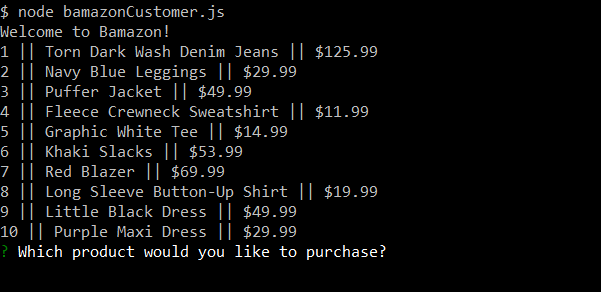
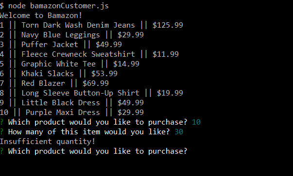
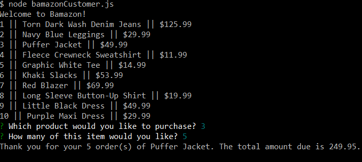

# Bamazon

A simple CLI program which uses Node.js and mySQL. It displays all products that are listed in the database.

The customer selects which item they would like and the program checks if there is enough inventory for the item the customer wants. If there are enough items then it totals the cost, however, if there is not enough stock the customer is informed and allowed to make another selection.

Behind the scene, if there is enough inventory, the requested amount of items is deducted from the total amount of inventory in the database.

The program starts listing all the products and their prices.

The customer is informed that there is not enough inventory for that item and asked to make a selection again.

The customer made a successful purchase.

### Built With

* JavaScript
* Node
* mySQL

### Contributers

* Rachel Parris
